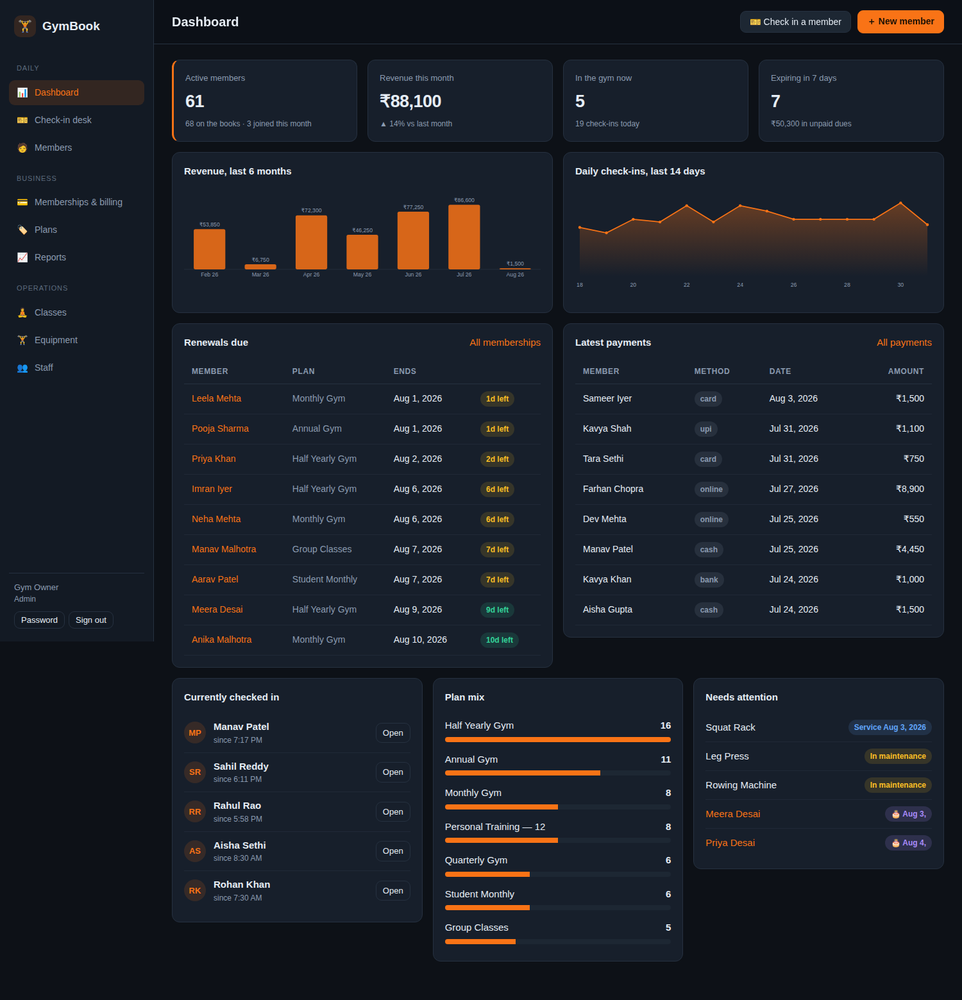

# GymBook — Gym Management Software

A complete gym management system in the spirit of GymBook: members and their
memberships, billing and dues, front-desk check-ins, class timetables and
bookings, trainers, equipment maintenance, and the reports that tie it together.

Runs on Node.js with SQLite. No build step, no native modules, one dependency
(Express) — clone, install, seed, open.



## Quick start

```bash
npm install
npm run seed     # optional: 68 demo members, a year of history
npm start        # http://localhost:3000
```

The first run creates an admin account — `admin@gymbook.local` / `admin12345`
unless you set `ADMIN_EMAIL` and `ADMIN_PASSWORD`. Change the password from
the sidebar once you are in.

After seeding, these demo logins also work — all with the password `demo12345`:

| Login | Role | Can do |
| --- | --- | --- |
| `priyanka@gymbook.local` | manager | Everything except staff accounts |
| `dinesh@gymbook.local` | trainer | Members, check-ins, classes |
| `desk@gymbook.local` | front desk | Members, check-ins, classes |

## What it does

**Members** — searchable, filterable roster with member codes (`GM0001`),
contact and emergency details, health notes for trainers, join date and status.
Filter by membership state (active, expiring within 7 days, expired, has dues,
never subscribed) and sort by name, join date, expiry or outstanding balance.
Each member gets a profile with membership history, payments, visits, class
bookings, total dues and visit counts.

A member can have a photo — uploaded from a file or captured from a webcam,
center-cropped and compressed client-side before it's saved. It replaces the
initials avatar on the roster and profile, and appears on the printed/downloaded
QR ID card.

**Plans and memberships** — define plans by price, duration and optional session
limit (e.g. "Personal Training — 12"). Selling a membership derives the end date
from the plan and can collect payment in the same step. Renewals start the day
after the current membership ends, so nobody loses days they paid for; a queued
renewal is shown on the member's card. Memberships can be frozen and resumed —
resuming credits back every day the membership sat frozen. Cancelling keeps the
payment history intact.

**Billing** — record payments against a membership or standalone, in cash, card,
UPI, bank transfer or online. Dues are derived, never stored: what was billed
across non-cancelled memberships minus what was collected. The billing view
totals contract value, collected and outstanding for whatever you filter to, and
offers a one-click Collect on anything unpaid.

**Check-in desk** — type or scan a member code and press enter. The desk gets an
immediate verdict: welcome with the expiry date and remaining sessions, or a
refusal that says why (no active membership, frozen, sessions used up). Session
plans decrement on check-in. Repeat scans the same day are recognised rather than
duplicated. Live list of who is in the gym, with check-out.

**QR ID cards** — every member gets a printable card carrying a QR code. Print
one from the member's page, or tick several on the members list and print a sheet
of them; cards are laid out at CR80 size (3.375in × 2.125in) so they line up with
standard card stock and laminate pouches. There is also a downloadable PNG for
sending a member their card over WhatsApp or email — it carries the member's
photo when one is set.

At the desk, scanning a card shows who it is — photo, plan, expiry, sessions left,
outstanding dues, and whether they are already inside — and checks them in from
that panel. Two ways to scan:

- **Camera** on the desk device — works on every modern browser. Where the
  platform provides a native barcode engine (Android, ChromeOS, macOS) that gets
  used for free; everywhere else, including Chrome and Edge on Windows and Linux,
  the desk falls back to a vendored decoder fetched on first use
  ([public/js/vendor/jsqr.min.js](public/js/vendor/jsqr.min.js), ~46 KB gzipped,
  regenerate with `npm run vendor:jsqr`).
- **Handheld scanner** pointed at the member-code box, which these scanners type
  into like a keyboard. Nothing to install.

Camera access needs a secure origin, so the desk must be on HTTPS or localhost —
over plain http on a LAN address the browser refuses regardless of hardware, and
the desk says exactly that rather than blaming the browser. A handheld scanner
works either way. The same restriction applies to taking a member's photo with
a webcam. A quick way to get HTTPS to a phone or another device on your network
without a domain is a Cloudflare quick tunnel (`cloudflared tunnel --url
http://localhost:3000`) — its `*.trycloudflare.com` hostname is recognised
automatically and routed to the default gym even without `ROOT_DOMAIN` set.

The code on a card is a random 128-bit secret, not the member code — member codes
run GM0001, GM0002…, so deriving cards from them would let anyone print a working
card. A payload that arrives carrying the card prefix is matched against issued
cards only, which is what stops a hand-made QR reading `GB1:GM0042` from checking
in whoever owns that code. Lost a card? Reissue from the member's page: the old
one stops working immediately.

**Classes** — weekly timetable with trainers, rooms, capacity and live seat
counts. Book members into a class; the server enforces capacity, the right
weekday and no double-booking, and lets a cancelled seat be re-booked. Mark
rosters as attended or no-show.

**Equipment** — inventory with categories, serial numbers, purchase cost and
service dates. Send an item to maintenance and mark it serviced in one click;
the next service date rolls forward automatically. Overdue services surface on
the dashboard.

**Staff** — accounts with four roles. Admins manage staff and can delete
records; managers handle billing, plans, classes and equipment; trainers and
front-desk staff work with members, check-ins and bookings.

**Reports** — revenue by month or day, split by payment method and by plan;
check-ins per day, per hour and per weekday; most regular members; members at
risk (no visit in 14 days); new members per month; memberships sold versus
lapsed. Everything exports to CSV: members, payments, attendance, memberships.

**Dashboard** — active members, revenue this month against last, who is in the
gym right now, renewals due, unpaid dues, plan mix, upcoming birthdays and
equipment needing attention.

## Install it on a phone or tablet (PWA)

GymBook installs to the home screen on Android and iOS, and to the desktop on
Chrome and Edge. There is nothing to submit to an app store and nothing extra to
deploy — the running server is the app.

- **Android** (Chrome, Edge, Samsung Internet) — an "Install app" button appears
  in the sidebar, plus a one-time banner. Both call the browser's own install
  prompt. Long-pressing the installed icon gives shortcuts straight to the
  check-in desk, members and billing.
- **iPhone / iPad** — Safari has no install API, so the same button opens the
  exact steps instead: **Share → Add to Home Screen**. It must be Safari; Chrome
  on iOS cannot install web apps.
- **Desktop** — Chrome and Edge show an install icon in the address bar.

Installed, it runs full-screen with no browser bars, keeps clear of the iPhone
notch and home indicator, and shows its own offline state instead of the
browser's error page.

**Each gym installs as its own app.** The manifest is generated per request
(`src/routes/pwa.js`), so `/g/acme/` installs as "Acme Gym" and launches into
Acme's dashboard, while `/g/pulse/` on the same origin installs separately.
Icons live in `public/icons/` and are drawn by `npm run icons:gen` — a
dependency-free generator, so there is no image toolchain to install; the PNGs
are committed and only need regenerating if the mark changes.

**What works offline.** The service worker (`public/sw.js`) caches the app
shell, so an installed icon opens instantly and still opens with no signal —
showing "Can't reach GymBook" rather than a blank screen. It deliberately caches
**nothing** from `/api`: every response there is specific to one gym and one
signed-in person, and a cached member list on a shared front-desk tablet would
be both stale and readable by whoever picks it up next. So the app opens
offline; it does not operate offline. Check-ins and edits need the server.

Requires HTTPS (or `localhost`) — service workers refuse to register on a plain
`http://` LAN address, and the app degrades to a normal website there.

## Configuration

All optional — sensible defaults apply.

| Variable | Default | Purpose |
| --- | --- | --- |
| `PORT` | `3000` | HTTP port |
| `HOST` | `0.0.0.0` | Interface to bind — the default accepts connections from other devices on your network, not just localhost |
| `DB_FILE` | `data/gym.db` | SQLite database location |
| `AUTH_SECRET` | dev value | Token signing key — **set this in production** |
| `TOKEN_TTL` | `43200` | Session length in seconds |
| `CURRENCY` | `INR` | Currency for all money formatting |
| `GYM_NAME` | `GymBook` | Name shown in the UI |
| `ADMIN_EMAIL` / `ADMIN_PASSWORD` / `ADMIN_NAME` | — | First-run admin account |
| `PLATFORM_DB_FILE` | `data/platform.db` | Multi-tenant registry (which gyms exist, their billing status) |
| `TENANTS_DIR` | `data/tenants` | Per-gym SQLite files live here, one per tenant |
| `TRIAL_DAYS` | `7` | Free trial length for a newly signed-up gym |
| `RAZORPAY_KEY_ID` / `RAZORPAY_KEY_SECRET` | — | Razorpay API credentials — billing is disabled until both are set |
| `RAZORPAY_WEBHOOK_SECRET` | — | Verifies that `/api/platform/webhooks/razorpay` calls really come from Razorpay |
| `RAZORPAY_PLAN_ID` | — | The single monthly plan created in the Razorpay dashboard |
| `TRUST_PROXY` | `false` | Set to `true` only when actually deployed behind a reverse proxy — enables correct client IP/HTTPS detection |
| `LOGIN_MAX_ATTEMPTS` / `LOGIN_WINDOW_MS` / `LOGIN_LOCKOUT_MS` | `5` / `900000` / `900000` | Failed-login lockout: attempts, window, lockout duration |
| `SIGNUP_MAX_ATTEMPTS` / `SIGNUP_WINDOW_MS` / `SIGNUP_LOCKOUT_MS` | `10` / `3600000` / `3600000` | Same, for `/api/platform/signup` (per IP) |
| `ROOT_DOMAIN` | — | The exact production hostname (e.g. `yourapp.fly.dev`, later a real domain) — needed so a subdomain of it is read as a tenant slug instead of guessed from label count |
| `TENANT_URL_MODE` | `path` | Which address signup hands a new gym: `path` (`/g/acme`, works anywhere) or `subdomain` (`acme.example.com`, needs wildcard DNS + TLS). Both are always *accepted* — this only picks which one is advertised |
| `PLATFORM_ADMIN_EMAIL` / `PLATFORM_ADMIN_PASSWORD` | — | Operator console credentials. The console at `/#/platform` does not exist unless **both** are set |
| `BACKUP_DIR` | `backups/` | Where snapshots are written |
| `BACKUP_INTERVAL_HOURS` | `24` in production, off otherwise | How often the server backs itself up. `0` disables it in favour of an external scheduler |
| `BACKUP_KEEP` | `14` | Local backup folders to keep; older ones are pruned so a daily backup can't fill the disk |
| `BACKUP_S3_BUCKET` / `BACKUP_S3_ENDPOINT` / `BACKUP_S3_ACCESS_KEY_ID` / `BACKUP_S3_SECRET_ACCESS_KEY` | — | Off-site backup destination. Uploads stay off until **all four** are set |
| `BACKUP_S3_REGION` / `BACKUP_S3_PREFIX` | `auto` / — | Region (`auto` suits Cloudflare R2) and an optional key prefix |

## Onboarding: how a gym joins

The root domain is a public landing page. A gym owner clicks **Start free trial**,
picks a name and an address, creates their owner account, and lands in a working
gym — signed in, with three starter plans they can edit and sell straight away.
Signup provisions a registry row, a dedicated SQLite file, the admin account and
those plans in one step.

Each gym is then reachable two ways, and both work at the same time:

| | Address | Needs |
| --- | --- | --- |
| **Path** (default) | `https://yourapp.fly.dev/g/acme/` | Nothing — works on any hostname, including a throwaway tunnel URL |
| **Subdomain** | `https://acme.yourgym.com/` | A domain you own, with wildcard DNS and wildcard TLS |

Path addressing exists because Fly's shared `*.fly.dev` cannot issue wildcard
certificates, so on a fresh deploy there would otherwise be no reachable gym at
all. `resolveTenant` strips the `/g/<slug>` prefix off the URL before anything
else sees it, so past that point the two modes are indistinguishable and neither
needs its own code path. Point a real domain at the app later and the subdomain
form starts working with no changes — set `TENANT_URL_MODE=subdomain` to make
signup advertise it.

Inside a gym, **Gym settings** lets an admin change the gym name, currency and
timezone, and shows trial/subscription state with the button that subscribes.

### Operator console

Set `PLATFORM_ADMIN_EMAIL` and `PLATFORM_ADMIN_PASSWORD`, restart, and
`/#/platform` on the root domain lists every gym with its status, trial end and
member/staff/visit counts, and can suspend, reactivate, extend a trial or cancel.
It signs in with its own credentials and its own token shape — a gym's admin
token is rejected here, and the console's token is rejected inside every gym.
With either variable unset the console returns 404 rather than opening up.

## Deploy (Fly.io)

Fly.io was chosen over a bare VPS because it handles HTTPS and reverse-proxying for
you, and over serverless hosts (Vercel etc.) because this app needs a real, persistent
disk for its SQLite files — serverless filesystems don't survive between requests.

```bash
fly auth login                                    # opens your browser, one-time

fly apps create <pick-a-unique-name>
fly volumes create gymbook_data -a <app-name> -r sin -s 1
fly secrets set AUTH_SECRET=$(openssl rand -hex 32) -a <app-name>

# Optional: enables the operator console at /#/platform. Without both, it 404s.
fly secrets set PLATFORM_ADMIN_EMAIL=you@example.com \
                PLATFORM_ADMIN_PASSWORD=$(openssl rand -hex 16) -a <app-name>

fly deploy -a <app-name>

# Only after the first deploy do you know the assigned hostname:
fly secrets set ROOT_DOMAIN=<app-name>.fly.dev -a <app-name>
fly deploy -a <app-name>                          # redeploy so it takes effect
```

Then open `https://<app-name>.fly.dev` — that is the landing page, and the first
gym signs itself up from there at `/g/<their-slug>/`. No default admin account is
created on a production deploy, so the root domain has nothing to sign in to.

Update `app = "CHANGE-ME"` in `fly.toml` to match the name you picked, and
`primary_region` to whichever [Fly region](https://fly.io/docs/reference/regions/)
is closest to your users.

`fly.toml` keeps one machine running (`min_machines_running = 1`). The cheaper
`auto_stop_machines = "suspend"` scales to near-zero cost when idle, but a suspended
machine cannot answer a Razorpay webhook — and a missed webhook means a gym that *has*
paid gets suspended for not paying. It also stops the scheduled backup firing. Only go
back to suspending for a throwaway demo.

Not yet covered by this deploy: real Razorpay credentials, and a custom domain with
wildcard DNS for per-gym *subdomains* (Fly's shared `fly.dev` can't do this — only a
domain you own can). Gyms are reachable at `/g/<slug>/` in the meantime, so nothing
is blocked on it.

## Physical fingerprint devices (eSSL/Realtime/ZKTeco-family)

Members can check in on a physical terminal (tested against a Realtime T-52) instead
of only the front desk or WebAuthn. This talks to the device's own "push"/ADMS
protocol, which is community-reverse-engineered, not an official spec — expect to
verify/adjust it against your actual unit rather than trusting it blind.

1. Register the device's serial number (found on a label on the unit) so incoming
   punches are attributed to the right gym:
   ```
   POST /api/devices   { "serial": "RSS1110031760", "label": "Front desk" }
   ```
2. On the device's own menu, set its "Cloud Server"/ADMS server address to your
   deployed domain (e.g. `https://<your-app>.fly.dev`) — exact menu wording varies
   by firmware, check the device's manual.
3. For each member, set `device_pin` (via the normal member edit form/API) to the
   numeric ID you enroll their fingerprint under on the device.
4. Every request the device makes is logged server-side (prefixed `[iclock]`) —
   useful for confirming it's actually connecting, and essential if a punch isn't
   registering as expected, since the handshake/response format may need tuning
   for your specific firmware.

## Backups

Every tenant is a single SQLite file, so a backup is a file copy — taken with
SQLite's `VACUUM INTO`, which is safe against a live server: no downtime, no torn
copies, WAL or not.

**In production the server backs itself up every 24 hours** (`BACKUP_INTERVAL_HOURS`),
and takes one on demand with:

```bash
node scripts/backup.js
```

Either way it snapshots the platform registry and every tenant, then **reopens each
snapshot and verifies it** — `PRAGMA integrity_check` plus a real row count, because a
file nobody has ever opened is not a backup. Old local folders are pruned to
`BACKUP_KEEP` so a daily backup can't fill the volume and stop the live database
writing. The CLI exits non-zero on failure, so cron notices.

### Getting them off the machine

A snapshot on the same Fly volume as the live database protects you against a bad
`UPDATE` and nothing else — one volume failure takes both. Set these four and every
backup is also uploaded to any S3-compatible store (Cloudflare R2, Backblaze B2, MinIO,
S3 itself):

```bash
fly secrets set \
  BACKUP_S3_BUCKET=gymbook-backups \
  BACKUP_S3_ENDPOINT=https://<account-id>.r2.cloudflarestorage.com \
  BACKUP_S3_ACCESS_KEY_ID=... \
  BACKUP_S3_SECRET_ACCESS_KEY=... -a <app-name>
```

Until all four are present, uploads stay off and each run says so rather than
implying you are covered.

**Restore:** stop the server, copy the wanted file back over the original path (e.g.
`data/tenants/acme.db`), delete any stale `-wal`/`-shm` sitting next to it, start the
server again.

This gives a recovery point of at most one backup interval. Continuous replication
(Litestream streaming the WAL to the same bucket) would cut that to seconds and is the
natural next step; it needs an extra binary in the image, which is why it isn't here yet.

## Losing a password

There is no email transport in this app, so recovery is issued by someone who already
has authority over the gym rather than sent to an inbox.

- **Operator console** — **Reset password** next to any gym mints a single-use link,
  valid one hour, to pass to the owner over whatever channel they contacted you on.
  Works while a gym is suspended, which is exactly when an owner needs to get back in
  to pay. Optionally target one staff address instead of the owner.
- **Shell access** — for a single-gym install with no operator console:

  ```bash
  node scripts/reset-password.js --gym acme               # print a reset link
  node scripts/reset-password.js --gym acme --password '...'   # set one directly
  ```

Reset tokens are stored as SHA-256 digests, spent on first use, and reissuing drops any
earlier outstanding link.

## Layout

```
src/
  server.js        entry point
  app.js           express app and route mounting
  config.js        environment configuration
  db.js            schema and query helpers (node:sqlite)
  clock.js         UTC instants <-> the gym's local calendar dates
  auth.js          scrypt hashing, signed tokens, role guards
  passwordReset.js single-use recovery tokens
  photo.js         member photo bytes and their signed URLs
  backup.js        snapshot, verify, upload, prune
  s3.js            minimal SigV4 PUT, for off-site backups
  validate.js      request validation and date helpers
  maintenance.js   expires memberships past their end date
  bootstrap.js     first-run admin account
  routes/          auth, members, plans, subscriptions, payments,
                   attendance, classes, equipment, dashboard, reports,
                   pwa (the per-gym web app manifest)
public/
  index.html       single page app shell
  offline.html     shown when even the shell cannot be reached
  sw.js            service worker: caches the shell, never the API
  manifest         generated per gym — see src/routes/pwa.js
  css/app.css      dark theme
  icons/           installed-app icons (npm run icons:gen)
  js/api.js        typed API client and session storage
  js/ui.js         DOM helpers, formatting, tables, modals, SVG charts
  js/photo.js      member photo upload/camera capture, crop and compress
  js/pwa.js        install prompt, worker registration, update and offline UI
  js/app.js        router and layout
  js/views/        one module per screen
scripts/
  seed.js          demo data
  backup.js        take a backup now
  gen-icons.js     draws public/icons/*.png with no dependencies
  reset-password.js  recover a lost password from the shell
tests/             one suite per area
```

## Testing

```bash
npm test
```

325 tests over throwaway databases cover authentication and token tampering,
validation, member codes and duplicate detection, membership end-date maths,
overlap rejection, renewal start dates, dues, check-in rules and idempotency,
freeze/resume day credits, class capacity and weekday enforcement, role
permissions, dashboard aggregates and CSV export, multi-tenant isolation,
trial/billing lifecycle and webhook signatures, login lockout, fingerprint
terminal uploads, WebAuthn enrollment and check-in against a software
authenticator, QR card issuing, scanning, reissue and forgery rejection,
gym-local date handling across timezones, member photo storage and its signed
URLs, password-reset issue/redeem/expiry, backup verification and pruning, and
the installable-app surface — per-gym manifest, icon sizes, service worker
headers and precache list.

## Notes on the design

- **Dues are computed, not stored.** Balances are always derived from
  memberships and payments, so a corrected payment immediately corrects the
  balance and no reconciliation job is needed.
- **Membership expiry is lazy.** Rather than run a scheduler, any read that
  reports on membership state first flips memberships past their end date to
  expired. Cheap, and the numbers can never be stale.
- **Instants are UTC; calendar dates are the gym's.** `check_in`, `created_at`
  and friends are UTC, because an instant has no timezone to lose. `paid_on`,
  `joined_on`, `start_date` and `end_date` are the gym's own local date, because
  "the day Rahul paid" is a wall-clock fact about the gym. `src/clock.js` is the
  only place that crosses between the two — SQLite's bare `date('now')` means
  "today in UTC", which for a gym in IST is still yesterday until 05:30, right
  when the morning batch arrives.
- **Member photos are bytes behind a signed URL,** not base64 in a column. An
  `` cannot send a Bearer token, so the URL authenticates itself: signed
  with the server secret, scoped to one member of one gym, and expiring. It
  carries a version, so a changed photo is a new URL and no cache can go stale.
- **Plans in use are archived, not deleted**, so historical memberships keep
  pointing at a real plan.
- **`node:sqlite` and Express only.** No ORM, no bundler, no CSS framework, no
  native compilation — `npm install` is fast and the app runs anywhere Node 22.5+
  does.
